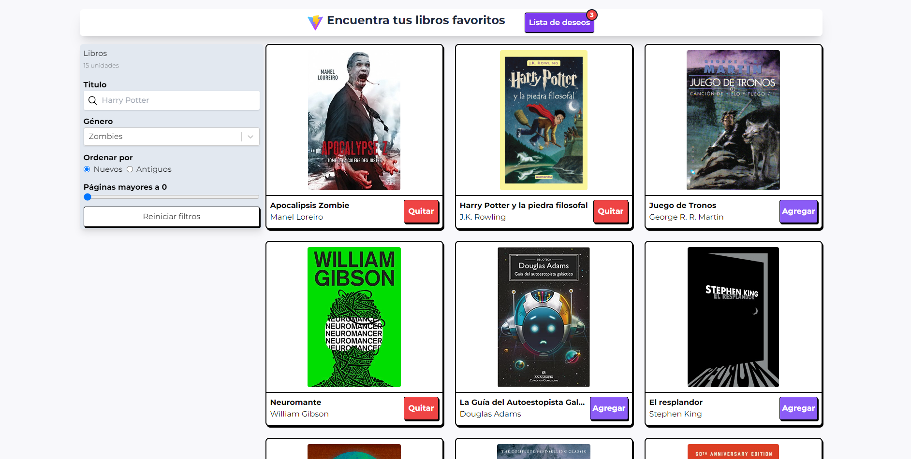

# React + TypeScript + Vite


# Library ⚛️📚

Aplicación para buscar libros y agregarlo a tu lista de deseos


## Stack

 - React
 - Vite
 - Zustand
 - Wouter


## Authors

- [@githubpopckorn](https://github.com/githubpopckorn)


## Develop

Para levantar el proyecto debes

```bash
  cd ./project-folder
```

```bash
  npm install
```

```bash
  npm run dev
```


## Features

- Light/dark mode toggle
- Live previews
- Fullscreen mode
- Cross platform


## Feedback

Si tienes algun feedback o recomendación puedes encontrarme en santy_lopez@live.com.ar


## 🚀 About Me
Full stack developer...


## License

[MIT](https://choosealicense.com/licenses/mit/)


## Screenshots




## Expanding the ESLint configuration

If you are developing a production application, we recommend updating the configuration to enable type aware lint rules:

- Configure the top-level `parserOptions` property like this:

```js
   parserOptions: {
    ecmaVersion: 'latest',
    sourceType: 'module',
    project: ['./tsconfig.json', './tsconfig.node.json'],
    tsconfigRootDir: __dirname,
   },
```

- Replace `plugin:@typescript-eslint/recommended` to `plugin:@typescript-eslint/recommended-type-checked` or `plugin:@typescript-eslint/strict-type-checked`
- Optionally add `plugin:@typescript-eslint/stylistic-type-checked`
- Install [eslint-plugin-react](https://github.com/jsx-eslint/eslint-plugin-react) and add `plugin:react/recommended` & `plugin:react/jsx-runtime` to the `extends` list
